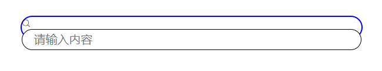

#### 第一个小案例

​	模仿写了一个谷歌搜索的页面，发现自己在布局方面还有许多问题，这么一个简单的页面，我竟然花费了许久还没做完没，汗颜

第一个问题是：DOM结构的问题，布局很重要，然后就是css 的小细节，比如我再做搜索框的时候，思路是，用一个div 包裹一个 input 然后抹去input 的默认样式，使用div 边框伪造一个input 的边框来显示，然后两头有两个图标，搜索和语音按钮，设置div 的宽高后，设置input宽高各100% 继承div 的宽度和高度，结果发现input 被顶下来了，搞了好久才发现，原因是div 里面还有一个搜索按钮的伪类，当我将搜索按钮设置定位后，它脱离了文档流，自然不占据空间，此时，input 就与div 完没重合！哎，这点小毛病我看了半天没发现。。。。。。

还有就是盒模型水平居中的问题，其实设置好盒模型的宽度后，设置margin 左右 auto即可，也被我遗忘得一干二净！

还有，背景图片是不会撑起盒模型元素的高度和宽度的，它只是一个背景而已，盒子里面没有内容，它也不会显示；

还有，input 的outline 属性是点击它时他的外边框，以前都没注意，或者忘了，哈哈哈

#### 第二个小案例

​	实现效果为，点击A链接弹出弹框和遮罩层，dom结构中给遮罩层加一个div 包裹弹框，然后给div设置遮罩层效果，利用:target 伪元素控制遮罩层的显示和隐藏。

#### 第三个小案例

​	模仿文字悬浮提示

DOM结构很重要

实现效果为 一行文字鼠标悬停时有小框提示，难点在于小三角的定位，情况复杂时还要考虑到元素的 z-index，总之悬浮框的层级要高一些才行，悬浮框在dom结构中被包裹在文字所处的div中，由于后期要对三角做定位，所以要先给文字做个相对定位，到时候三角相对于文字来定位即可，三角可以通过：before 伪元素来实现，利用border的特性，不需要的边设置透明，另一边设置想要的颜色；

#### 第四个小案例

​	实现滚动页面时，页面上的标题被下一个推走或者覆盖的效果，这里使用 positon 的 sticky 属性可轻易实现

特性 

一定要设置top  当页面向下滚动时，被视窗顶部拦住，被父级块元素的 下边缘推走

 如果出现多个sticky，放置在同一容器内，会出现下一个 sticky元素把上一个“覆盖””的效果

 如果出现多个sticky，放置在并列的多个块级容器内，会 出现下一个sticky元素把上一个“推走”的效果