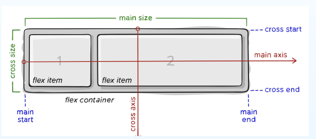

#### 相关概念

1. 主轴
2. 侧轴
3. flex 容器
4. flex 子项

#### 使用方法

容器相关属性

display:flex; / inline-flex;  声明使用flex 布局; flex 内部使用flex布局，对外展示块级特性 • inline-flex 内部用flex布局，对外展示内联特性

flex-direction  定义一个flex 子项排列的方向(水平排列/垂直排列)

- row : 默认值，子项水平排列 

- column: 子项从上到下排列 
-  row-reverse: 子项水平逆序排列 
-  column-reverse: 子项垂直逆序排列

flex-wrap flex子项默认挤到一行放置，该属性课设置是否折行放置

- no-wrap: 默认值，所有子项放置到一行 
-  wrap: 子项会折行放置到多行(从上到下折) •
- wrap-reverse: 子项会折行放置到多行(从下到上折)

flex-flow 这是flex-direction和 flex-wrap 的合并写法

justify-content 定义子项沿着主轴的分布方式

- flex-start flex-end center space-between space-around space-evenly

align-items  定义子项沿着侧轴的分布方式

- flex-start flex-end center stretch baseline

align-content 与align-items 相同，区别在于在有多行的时候有效 即 flex-wrap wrap 时

#### flex子项属性

order 设置子项在容器中的次序，值为数字，默认为0

flex-basis 设置子项的占用空间。如果设置了值，则子项占用的空间为设置的值； 如果没设置或者为 auto，那子项的空间为设置的width/height 的值

flex-grow  用来“瓜分”父项的“剩余空间。

flex-shrink  用来“吸收”超出的空间。

flex = flex-grow、flex-shrink、flex-basis的结合。

align-self  单独设置子项的沿侧轴的位置

#### 应用场景

- 两栏布局
- 三栏布局
- 水平等分 等

