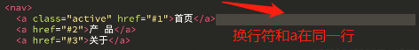
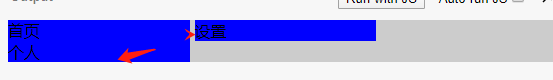

##### 块级盒子特点

- 盒子会在水平方向上扩展并占据父容器在该方向上的所有可用空间()
- 每个盒子都会换到新行 （独占一行）
- width 和 height 属性有效
- 内边距（padding）, 外边距（margin） 和 边框（border） 会将其他元素从当 前盒子周围推开（也就是说如果它是一个子元素，它会撑开父容器，前提是父容器没有设置高度，设置了背景色可以观察到）
- 可通过 display 属性改变显示类型

##### 行级盒子

- 盒子不会产生换行
- width 和 height 属性将不起作用。
- 内边距、外边距以及边框会被应用但是不会把其他处于 inline 状态的盒子推开（它如果是个子元素，你给它设置了内边距，父容器也不会被撑开，前提是父容器没有设置高度，设置了背景色可以观察到，如果想让它撑开可以设置 display:inline-block）
- 可通过 display 属性改变显示类型

```html
<div class="box">
    <span>首页</span>
    <span>设置</span>
    <span>个人</span>
    <span>我的</span>

  </div>

.box {
  background:#ccc;
}
span{
  padding:10px;
  background:blue;
  cursor:pointer;
  display:inline-block;
}
```

##### display:inline-block 行内盒模型 （既有块级盒子的属性（宽高）又有行内元素的特点 没有换行）

###### 对行内元素设置padding,会对背景色产生效果，但它不会撑开父容器，而会溢出

此时发现，


选项卡之间有缝隙，这个缝隙是哪里来的呢？行内元素时没有外边距合并这一说的；

缝隙产生的原因？

- TAB、 LF、 FF、 CR、 SPACE 都是空白字符 
-  多个连续的空白字符会合并成一个空格，而空格也占据 一个字符的空间 
-  white-space 属性可以修改合并规则

###### white-space 规定段落中的文本不进行换行

```css
p{
  white-space: nowrap
  }
```


这是由于编辑器中这些字符的原因，我们在编辑器中写代码是有一定的缩进和换行的，这些缩进和换行符也占据一定的空间，展示在页面上就是这个缝隙；而对于块级元素来说，它本身就占据一行，所以它是否换行并不会产生这个缝隙；而对于行内元素，它本身并不占据一整行的空间，就算设置了Inline-block也只是可以设置宽高，所以如果你换行的话，那它就和换行符号在一行，自然就有了缝隙。看下图



场景：我想让三个panel 平均占据在一行

```html
  <div class="box">
    <span>首页</span>
    <span>设置</span>
    <span>个人</span>
  </div>
<style>
    .box {
  background:#ccc;
}
span{
  background:blue;
  cursor:pointer;
  display:inline-block;
  width:33.3%;
}
</style>

```



发现由于我们书写时换行导致它中间有缝隙，而折行了，我们可以把空白字符都删除掉，把代码写成这样  ,但显然这并不符合我们的编码习惯，代码变得非常不易读

```html
 <span>首页</span><span>设置</span><span>个人</span>
```

那如何解决呢？

- 通过设置font-size解决 
-  通过更改布局方式来解决，比如使用float、flex、grid布局

这些空白字符和换行符，最终也是文字存储在我们的文件中，那我们就可以控制它的字体大小，我们把父容器字体大小设置为0，那是不是所有的文字内容都看不到了，那我们再单独设置我们要展示的文字内容大小即可；因为这个案例我们的背景色是由它的paddin撑开的；它本身没有宽高，所以没了字体后会看不到；真神奇


