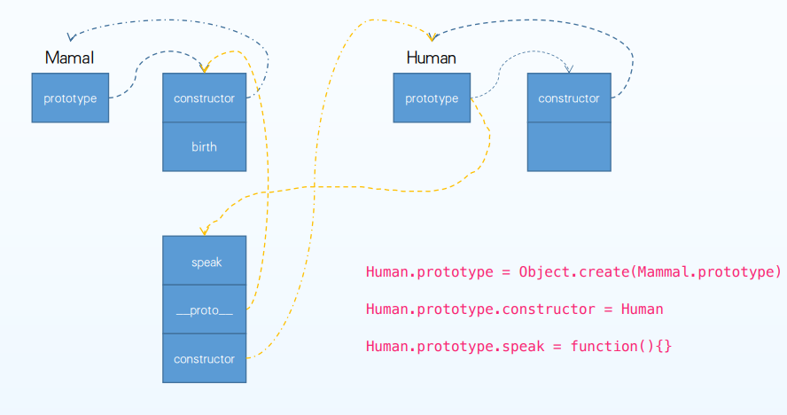
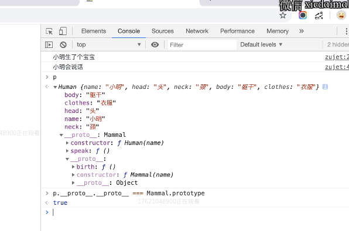

原型链设计机制一直是大多数前端开发最难理解的部分，据说当初 Brendan Eich 设计之初不想引入类的概念，但是为了将对象联系起来，加入的C++ new的概念，但是new没有办法共享属性，就在构造函数里设置了一个prototype属性，这一设计理念成为了js跟其他面向对象语言不同的地方，同时也埋下了巨大的坑！

为了解决因为委托机制带来的各种各样的缺点及语法问题，es6之后引入的class，class的实质还是基于原型链封装的语法糖，但是却大大简化的前端开发的代码，也解决了很多历史遗留的问题





注意看此图，刚刚我们的操作就是把父类的prototype 挂载到了这个对象的—proto—上(执行了Human.prototype = Object.create(Mammal.prototype) //将human原型执行mammal原型 )

#### 创建对象

构造函数方式创建

```javascript
function Dog(color) {
this.color = color
this.sayColor = function() {
console.log(`汪汪${this.color}`)
}
}
let dog1 = new Dog('red')
dog1.sayColor()
let dog2 = new Dog('yellow')
dog2.sayColor()
```

new Dog做了哪些事?

- 创建一个空对象{}，假设名字是tempObj
- 执行Dog函数，执行过程中对 this 操作就是对tempObj 进行操作(使用apply调用构造器函数，this绑定到空对象obj上)
- 函数执行完毕后返回刚刚创建的tempObj
- 把tempObj赋值给dog1

```javascript
function NEW_OBJECT(Foo){
    var obj={};
    obj.__proto__=Foo.prototype;
    obj.constructor=Foo;
    Foo.apply(obj,arguments)
    return obj;
}
```

<!--more-->

#### 重新认识函数

- 所有函数都有一个.prototype属性，对应的是一个空对象（暂且认为）
- 当用new 函数 创建对象时，对象都拥有.__proto__属性，都指向该函数 的.prototype
- 当使用对象的属性时，先从自有属性找，找不到再从.__proto__里找

#### instanceof

用于检测构造函数的 prototype 属性是否出现在某个 实例对象的原型链上

````javascript
[] instanceof Array // true
{} instanceof Object //true
(function(){}) instanceof Function //true
Object instanceof Function // true
//数组是Array函数的实例
// 字面量对象是Object函数的实例
// 函数是Function函数的实例
// Object函数是Function函数的实例
````

#### 几条经验

- new 一个函数，(即：使用new创建对象)这个函数的 prototype等于创建的对象的 \__proto\__
- 普通的对象是Object函数创建的
- 任何函数都是由Function函数创建的
- Function创建了Function

#### 原型

​      **每一个对象都有\__proto\__属性， 但是只有函数对象才有 prototype 属性**

几乎所有的 JavaScript 对象都是 [`Object`](https://developer.mozilla.org/zh-CN/docs/Web/JavaScript/Reference/Global_Objects/Object) 的实例；一个典型的对象继承了`Object.prototype`的属性（包括方法），尽管这些属性可能被遮蔽（亦称为覆盖）。但是有时候可能故意创建不具有典型原型链继承的对象，比如通过[`Object.create(null)`](https://developer.mozilla.org/zh-CN/docs/Web/JavaScript/Reference/Global_Objects/Object/create)创建的对象，或者通过[`Object.setPrototypeOf`](https://developer.mozilla.org/zh-CN/docs/Web/JavaScript/Reference/Global_Objects/Object/setPrototypeOf)方法改变原型链。

当我们试图访问一个对象下的某个属性的时候，会在JS引擎触发一个GET的操作，首先会查找这个对象是否存在这个属性，如果没有找的话，则继续在prototype关联的对象上查找，以此类推。如果在后者上也没有找到的话，继续查找的prototype，这一系列的链接就被称为**原型链**。

```javascript
class Dog {
constructor(color) {
this.color = color
}
}
let dog1 = new Dog('yellow')
console.log(dog1.toString()) //"[object Object]"
```

- new Dog创建dog1对象，Dog.prototype === dog1.\__proto\__ 
-  dog1.\__proto\__是个普通对象，是由new Object 创建的， Object.prototype === dog1.\__proto\__.\__proto\__ 
- dog1.toString === dog1.\__proto\__.\__proto\__.toString (在控制台观察dog1就能发现)

#### （原型）继承

**四种写法的思考**

**1：A.prototype = B.prototype**

这种方法很容易理解，A要继承B原型链属性，直接改写A的Prototype关联到B的prototype，但是，如果在A上执行从B继承过来的某一个属性或方法，例如：A.prototype.myName =…会直接修改B.prototype本身。

**2：A.prototype = new B()**

这种方式会创建关联到B原型上的新对象，但是由于使用构造函数，在B上如果修改状态、主车道其他对象，会影响到A的后代。也就是说要执行 

```text
A.prototype.constructor = A;
这行是把A的constructor重新设为A，不然的话它就会变成B
```

作者：李引证
链接：https://www.zhihu.com/question/20801227/answer/16239270
来源：知乎
著作权归作者所有。商业转载请联系作者获得授权，非商业转载请注明出处。


1.为啥是 B.prototype = new A(); 而不是 B.prototype = A or B.prototype = A.prototype？要实现继承，就必须保证B继承A以后，B所做的修改不能影响到A以及继承自A的其它对象。如果B.prototype = A的话，那么着两个对象的引用是完全一致了，这样的话，如果赋值 B.prototype.name=45455；那么A.name就直接变成45455;直接把A和继承自A的其它对象全部改了，这根本谈不上继承。至于B.prototype = A.prototype也是同理，修改B的原型就会直接把A的原型给污染掉。B.prototype = new A();这个方法，是创建了一个新的对象{}，并且继承了A的原型，这是一个新对象，不是和A同一引用，所以不会污染A。我们先把B.prototype改成另外一个名字，叫XXX，此时XXX=new A();
**当你请求XXX. whatever的时候，此时它不存在，将会向上从构造函数，也就是A（）里找**

也就是B.prototype. whatever ==XXX. whatever ==A.prototype.whatever
这就顺利的请求到了值，而且不会污染A。

```text
B.prototype.constructor = B;
这行是把B的constructor重新设为B，不然的话它就会变成A（好像也不会，因为只是更改了原型的指向）
```

**3：A.prototype = Object.create(B.prototype)** (ES5新增)  （继承父类的原型一般上面有方法）

Object.create()是个很有意思的函数，用一段简单的polyfill来实现它的功能：

```
Object.create = function(o) {
  function F(){}
  F.prototype = o;
  return new F();
};
//objct.create使用; 把person1当做person2的proto
let person1 = {name: '饥人谷'}
let person2 = Object.create(person1)
```

创建一个新的空对象，用参数作为新对象 的原型\__proto\__

**4：Object.setPrototypeOf( A.prototype, B.prototype );** (ES6新增)

#### 继承

获取父类方法

```javascript
//父类
function Mammal(name) {
this.name = name
this.head = '头'
this.neck = '颈'
this.body = '躯干'
}
Mammal.prototype.birth = function() {
console.log(this.name + '生了个宝宝')
}
let animal = new Mammal('大汪')
animal.birth()
//人类
function Human(name) {
Mammal.call(this, name)
this.clothes = '衣服'
}
Human.prototype = Object.create(Mammal.prototype) //将human原型执行mammal原型
Human.prototype.constructor = Human  //
Human.prototype.speak = function() {
console.log(this.name + '会说话')
}
let p = new Human('小明')
p.birth()
p.speak()
```

创建步骤见图1；

获取父类的属性

```javascript
//.........
function Mammal(name) {
this.name = name
this.head = '头'
this.neck = '颈'
this.body = '躯干'
}
Mammal.prototype.birth = function() {
console.log(this.name + '生了个宝宝')
}
let animal = new Mammal('大汪')
animal.birth()

function Human(name) {
//等价于 Mammal(name)，Mammal里面的this是当前的this
Mammal.call(this, name)  //.call就是执行这个函数，更改函数中this为传递的参数；
this.clothes = '衣服'
}
Human.prototype.speak = function() {
console.log(this.name + '会说话')
}
let p = new Human('小明')
console.log(p.head)
console.log(p.clothes)
p.speak()
//此时 p对象就拥有了哺乳动物父类的一些属性；
```

#### ES6实现继承

使用 extends 关键字他会把属性和方法一并继承下来

```javascript
//省略上面 mammal的定义
class Human extends Mammal{
  constructor(name){
    super(name);
    this.clothes = '衣服';
  }
//   constructor(...args) {
//     super(...args) this.clothes = '衣服'
//   }
  speak() { 
    console.log(`${this.name}会说话`)
  }
}

let p = new Human('小明')
p.birth() 
p.speak()
```

#### hasOwnPerperty

判断对象自身属性中是否具有指定的属性（即不是原型链上的属性，继承过来的也算自身的）

#### 实现instanceof

用于检测构造函数的 prototype 属性 是否出现在某个实例对象的原型链上

```javascript
function _instanceof(obj, fn) {
let __proto__ = obj.__proto__
while(1) {
if(__proto__ === null) return false
if(__proto__ === fn.prototype) return true
__proto__ = __proto__.__proto__
}
}
class People {}
let p = new People
_instanceof(p, People)
_instanceof(p, Object)
```

#### 拓展

##### Object.assign

- 将所有可枚举属性的值从一个或多个源对象复制到目标 对象 
-  它将返回目标对象。

```javascript
const target = { a: 1, b: 2 }
const source = { b: 4, c: 5 }
const returnedTarget = Object.assign(target, source)
console.log(target) // { a: 1, b: 4, c: 5 }
console.log(target === returnedTarget) // true
```

##### Mixin

- 通过不使用继承的方式让一个类中的方法被其他类复用 
-  参考: https://en.wikipedia.org/wiki/Mixin

```javascript
const mixin = (Base, mixins) => Object.assign(Base.prototype, mixins)
const Fly = {
canFly() { console.log('I can fly') }
}
class Mammal {
birthChild() { console.log('I birth a baby') }
}
mixin(Mammal, Fly)
let m = new Mammal()
m.birthChild()
m.canFly()
```

##### Mixin变异版

```javascript
const FlyMixin = Base => class extends Base {
canFly() { console.log('I can fly') }
}
const SwimMixin = Base => class extends Base {
canSwim() { console.log('I can swim') }
}
class Mammal {
birthChild() { console.log('I birth a baby') }
}
const FlyMammal = FlyMixin(Mammal)
let m1 = new FlyMammal()
m1.canFly()
const FlySwimMammal = SwimMixin(FlyMixin(Mammal))
let m2 = new FlySwimMammal()
m2.canFly()
m2.canSwim()
```

###### getter、setter

将对象属性绑定到查询/设置该属性时将被调用的函数,注意是函数

```javascript
const people = {
firstName: 'Micheal',
lastName: 'Jackson',
get fullName() {
return `${this.firstName} ${this.lastName}`
},
set fullName(name) {
let nameArr = name.split(/\s+/)
this.firstName = nameArr[0]
this.lastName = nameArr[1]
}
}
console.log(people.fullName)
people.firstName = 'John'
console.log(people.fullName)
people.fullName = 'Tom Cruse'
console.log(people.lastName)
```
