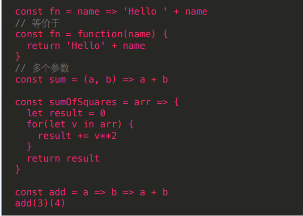
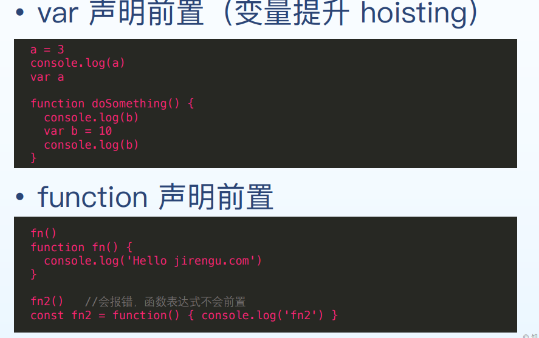
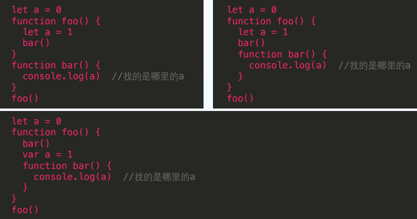
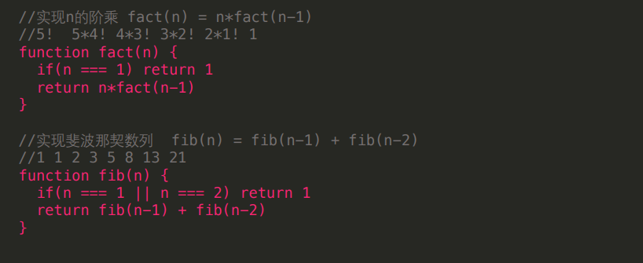
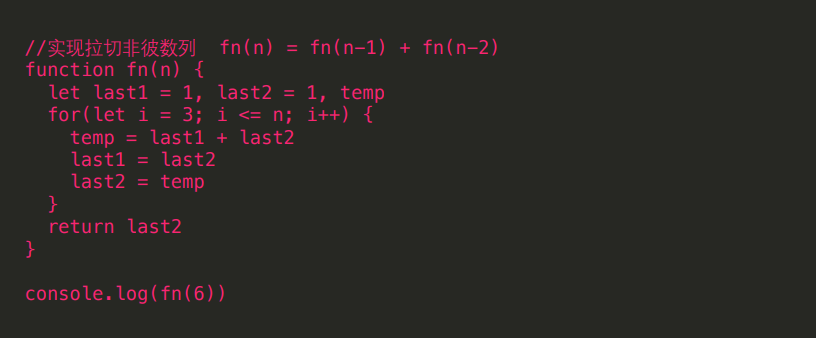

#### 函数相关

```javascript
function sum(a, b){
return console.log(a + b)
}
let result = sum(4, 5)
console.log(result)
```

以上代码输出结果为 “undefined”,因为 console.log()本身返回值就是 undefined；

#### 箭头函数

函数名=参数=>函数语句   单个参数，单行语句的情况

例如： const fn =name => 'hello'+name

name 为参数名称，"hello"+name 为函数语句 =>相当于大花括号

看下图：



#### 函数的命名规则

- 动词、动宾 sum、hide、show ü printName、sayHello 
- 返回一个非布尔值 ü getData、getBooks 
-  设置内容 ü setInfo、setData 
- 返回一个布尔值 ü canClicked、hasMoney、isEnabled

<!--more-->

#### 变量提升（作用域）

var 声明前置（变量提升 hoisting）

即在未定义之前可以调用它，引文js上下文会把后续所有var变量先定义执行，也就是提到前面；

function 声明前置：同上



例1中，会正确输出 a,即使它是在使用后声明的，因为，js 上下文会把当前上下文中所有var声明的变量，提到前面声明；即变成：var a; a=3;......  函数体重的b也是一样的

例子2中，fn()会正常输出，因为函数声明也会前置，fn2会报错，因为 此时，fn2() = fn2. fn2不是函数，执行会报错，也就是说，这个表达式没有没前置声明；

#### 作用域链

**- 函数在执行的过程中，先从自己内部找变量**

**如果找不到，再从创建当前函数所在的作用域去找，以此网上，直到全局作用域**

看如下案例：



例1中：输出a=0; 例2中：a=1; 例3中：a=undefined;

再看下面几个例子：

```
var a=1;
function fn1(){
  function fn2(){
    console.log(a);
  }
  function fn3(){
    var a=4;
    fn2();
}
  var a=2;
  return fn3;
}
var fn = fn1();
fn();   //输出多少 (2)
```

分析：最后执行fn()的结果，fn=fn1()；也就是fn= fn1()的执行结果，而fn1()的执行结果为 fn3。所以fn()就是去执行fn3,然后进入 fn3中分析，a=4，执行fn2()，fn2()中打印 a,此时 fn2函数体中未定义a,所以此时是undefined,然后从定义fn2()的作用域中去找，也就是从fn1（）作用域中去找，此时因为 var fn=fn1()；已经执行了，所以，在fn1()中 a=2.所以 输出结果为2；

```
var a=1;
function fn1(){
  function fn3(){
    var a=4;
    fn2();
}
  var a=2;
  return fn3;
}
 function fn2(){
    console.log(a);
  }
var fn = fn1();
fn();   //输出多少 (1)
```

以此类推，上面的输出结果为1；

```
var a=1;
function fn1(){
  function fn3(){
     function fn2(){
    console.log(a);
  }
    fn2();
    var a=4;
}
  var a=2;
  return fn3;
}

var fn = fn1();
fn();   //输出多少 (undefined)
```

同上，得出输出undefined;

#### 递归

- 自己调用自己 
-  设置终止条件



你细品，就是这个道理

#### 递归缺点 多次重复计算，性能差  优化



细品：前两位为1，所以从第三位开始计算，最终返回n位的拉切非彼数

#### 柯里化

是把接受多个参数的函数变换成接受一个单一参数的函 数

一个函数里返回一个新函数

```
function add(a) {
return function(b) {
return a + b
}
}
//add(3, 4)
add(3)(4) 相当于上面的写法，真神奇
```

好啦   ------------》》》》 END