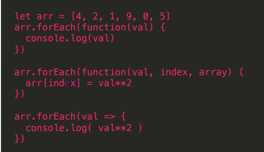

#### 字符串

写法：

- 双引号
- 单引号
- ``（es6写法）

#### 长字符串

- 可以用+号拼接
- 转义掉最后面的换行符
- ``长字符串

例如： let longStr1 = 'hello '+'world'

let longStr2 =&#96;饥人谷
							 培养有灵魂的工程师&#96;  //此时可以包含回车，会正常输出换行，即按照显示的格式输出

let longStr3 = 'hello\
								name'   此时，\转义掉该行的换行符

<!--more-->

#### 字符串模版

&#96; xxxx${变量}yyyy&#96;

${变量名} 解析变量

字符串方法  注意，字符串操作不会修改原来的字符串

- str.length

- str.charAt(下标) 输出该下标位置的字符串

- str.charCodeAt(下标) 输出该位置的字符串的asii码

- str.search()  str.search('ab') ;// 输出ab在该字符串中的起始下标

- str.indexOf 、str.lastIndexOf

- str.includes('el');  //检验该字符串是否包含 ‘el’ 结果为 true or false

- str.startsWith('he');  //检验该字符串是否以 el开头，返回布尔值

- str.endWith('hi'); 检验该字符串是否以hi结尾，返回布尔值

- str.substr(起始下标，长度); //返回新的截取的字符串

- str.substring(起始下标，结束下标不包含); //同上

- str.slice(起始下标，结束下标不包含);

- str.split(分隔符)； //以分隔符分割字符串，返回数组

- str.padStart(字符串总长度，‘填充符号’);//用指定的填充符号填充字符串到指定的位数，且在前面填充；类似的还有 str.padEnd();

  #### 数组

  数组的定义

  1. let arr = ['a','n',1,2];
  2. let arr = Array(5);   //指定数组的长度

  #### 数组的方法

  - arr.pop()  //从数组的尾部弹出一位
  - ar.push(); // 从数组的尾部加入一位
  - arr.shift(); //从数组的头部移除一位
  - arr.unshift(‘要添加的元素’); //从数组的头部添加一位

  slice ()参数： 1.开始索引(插入在前)；2.删除元素的个数；3.插入的新元素，可以写多个 ü 返回：一个由删除元素组成的新数组

  - arr.splice(起始下标，删除元素的个数); //从起始下标开始删除指定长度的元素
  - arr.splice(起始下标,删除元素的个数，新插入的元素); 返回一个由删除元素组成的新数组；

  - arr.concat(要连接的内容);
  - arr.sort(); //排序 ，默认是比较每个元素的首字母，首个数字，从小到大排列
  - arr.sort((a,b)=> a-b); //一般情况下，sort()的默认排序不能满足我们实际的需求，所以我们会扩展sort（）方法，传入一个函数，原理就是使用冒泡排序，最后升序或降序排列
  - arr.sort((a,b)=> a>b?1:-1); 而对于字符串类型的元素进行比较时，不能进行减法运算，我们采用比较大小的方式，也可以实现想要的排序效果
  - arr.reverse() 逆序排列，注意这是数组的逆序方法，如果想要对字符串执行该操作，需要先把字符串分割为数组，然后排序后再连接为字符串即可

  #### 数组的ES5方法

  - Array.isArray() 用来判断一个对象是不是数组 返回布尔值

  - Array.indexOf(); 用来查找指定元素的位置，找不到返回-1

  - arr.foreach()   遍历数组，参数为回调函数，回调函数里面的参数是：

    - 遍历到的对应元素
    - 元素序号（下标）
    - 数组本身

    


- array.every()  所有回调函数都返回true的时候结果才会返回true，否则 返回false

  ```
  let arr = [4, -2, 1, 9, 0, 5] 
  let isPositive = arr.every(val => val > 0) 
  console.log(isPositive) //数组全是正数吗 false
  ```

  

  

  - array.some()   只要有一个回调函数都返回true的时候结果就返回true

  ```
  let arr = [4, -2, 1, 9, 0, 5] 
  arr.some(val => val > 0) //数组里面有正数吗 true 
  arr.some(val => val < 0) //数组里有负数吗 treue
  ```

  

  

- array.filter() 过滤出满足条件的元素，构成新数组

  ```
  let arr = [4, -2, -1, 9, 0, 5]
  let arr1 = arr.filter(val => val > 0) //过滤出正数 
  console.log(arr1) // [4, 9, 5] 
  let arr2 = arr.filter(val => val < 0) //过滤出负数
  console.log(arr2) // [-2, -1]
  console.log(arr) //[4, -2, -1, 9, 0, 5] 原数组不变
  ```

  

  

- array.map() 遍历数组，回调函数返回值组成一个新数组返回，新数 组索引结构和原数组一致，原数组不变,

  ```
  let arr = [1, 4, 3, 9] 
  let arr1 = arr.map(v => v**2) 
  console.log(arr1) //[1, 16, 9, 81]`
  
  arr.map((item,index,arr) => {
      return item*10 //新数组为10,20,30,40
  })
  ```

  

- array.reduce() 

  .reduce(function(v1, v2), initValue) 

   遍历数组，调用回调函数，将数组元素组合成一个值 

   初始值可选

  当出现参数是个数组，最终得到一个值这种场景，考虑 使用reduce来简化代码

#### 扩展

- 手动实现一个 reduce（）方法

  ```
  function reduce(arr, fn, initValue) { /*补全*/}
  reduce([3, -1, 4, 0], (res, v) => res + v**2, 0) // 26
  //解答
  function reduce(arr, fn, initValue){
  var tmpArr = (initValue === undefined ? [] : [initValue]).concat(arr)
  while(tmpArr.length > 1){
  tmpArr.splice(0, 2, fn(tmpArr[0], tmpArr[1]))
  }
  return tmpArr[0]
  }
  ```

  分析：reduce()方法本身特点是传递三个参数，两个要操作的数组的元素和一个默认值，执行过程是，将数组中从头开始前两个经过一个函数的操作后聚合为一个值，然后重复该操作。最终返回一个值。我们手写实现方法时，需要三个参数，要操作的数组（数据源）,初始值，以及逻辑操作的函数；然后考虑，先构建数据源，reduce中，如果有初始值，则初始值在数组的最开始，所以判断如果初始值不为空，则拼接到构建的数组中，再拼接传递的数组。然后，reduce本身进行了什么事情呢，就是将数组中的前两位数经过 函数操作后替换掉对不对，所以我们使用.splice（）函数，最终数组中只剩下一个元素时，返回即可。好神奇。这就是算法最终变为代码的过程。太有意思了！

- 手动实现一个 map() 方法

  ```
  function map(arr, fn) { /*补全*/}
  map([3, -1, 4, 0], v => ++v) // [4, 0, 5, 1]
  //解答
  function map(arr, fn) {
  let res = []
  for(let v of arr) {
  res.push(fn(v))
  }
  return res
  }
  ```

- 手动实现一个 fileter () 函数

  ```
  function filter(arr, fn) { /*补全*/}
  filter([3, -1, 4, 0], v => v>0) // [3, 4]
  //解答
  function filter(arr, fn) {
  let res = []
  for(let v of arr) {
  if(fn(v)) res.push(v)
  }
  return res
  }
  ```

  

#### 数组的使用

###### 字符串逆序排列案例

######  学习了数组的reverse 方法后，我们可以很轻松的将一个字符串逆序排列，先把字符串使用split方法分割成数组，然后使用reverse()函数即可。那如果不适用这个api，我们可以怎么实现呢？

```javascript
//原生方法实现字符串逆序排列
//首先分析这个要求，逆序排列字符串，也就是说我们把字符串的头和尾部每一个都交换一下，就可以实现，那我们一共需要交换数组的长度/2次 对吧，没毛病，因为我们每次操作的是两个元素，好了开始写代码
let str = 'hello world'
function reverseStr(str){
    let temp; // 定义中间变量
  //注意，要先将字符串转换为数组来操作，因为字符串是无法通过下标的方式来修改里面的内容的，数组可以
    let arr = str.split('')
  //使用循环，循环次数为字符串长度/2
    for(let i =0;i<Math.round(arr.length/2);i++){
        temp = arr[i];
 //此时注意最后一个元素的下标的计算方式，是数组长度-1-i,因为 i一直在变化，最后一位也相应的在变化
        arr[i] = arr[arr.length -1 -i];
        arr[arr.length -1 -i] = temp;
 //当然也可以直接下面一个二维数组搞定交换的这个复杂动作(目前我还没理解，哈哈哈)
        // [arr[i],arr[j]] = [arr[j],arr[i]];
    }
    return arr.join('')
}
// 完成
//下一种方式，更容易理解
//同样也是使用循环的方式，交换值，义两个指针，一个指向数组头部，一个指向数组的尾部，每次执行完相应的操作后，头部下标加一，尾部下标减一，最后两个指针会相遇，当两个指针没碰面之前，我们一直重复这个交换的操作。此时起始的指针一定是小于后面的指针的，好了，开始编码
function reverseStr1(str){
    var arr = str.split('')
    //定义两个指针
    let i = 0;
    let j = arr.length-1;
    //起始下标小于终止下标之前我们都会做这个交换动作，你细品，即两个指针未碰面之前，起始下标在这个过程中会++ 结束下标会 --
    while(i<j){
        [arr[i],arr[j]] = [arr[j],arr[i]];
    }
    return arr.join('')
}

//完成 完美

```


