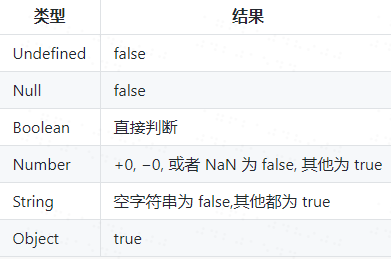
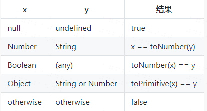
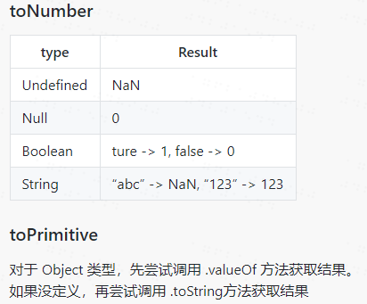

#### + 运算符

- 在两个操作数都是数字的时候，会做加法运算 
-  两个参数都是字符串或在有一个参数是字符串的情况下会把另外一个参数转换为字符串做字符串拼接 
-  在参数有对象的情况下会调用其valueOf或toString ü 在只有一个字符串参数的时候会尝试将其转换为数字 
-  在只有一个数字参数的时候返回其整数值（例如：+“3” 返回3）

#### ++x 和 x++

++x 表示x 先自加1在参与运算，而x++表示x先参与运算，再自加1

例如：a=1; b=a++; 此时 b=1; a=2；

​			a=1;b=++a; 此时  a=a+1=2; b = a=2;

​			-- 和 ++ 是一样的道理；

注意：我今天突然忘记了这种写法： a+=2; 代表 a=a+2; 时间久了不写，忘记了。哈哈，不只是+=包括%= -= 都是一样的道理；

<!--展开更多-->

注意，还有一种场景：

```
let a = 1
console.log( a+++a ) /** 此时打印出结果为：3**/
let a = 1
console.log( a+a++ ) /** 此时打印结果为： 2**/
解释如下：
  +
    /   \
   /     \
 a        a++

编译器的处理过程：
1. push(a), a入栈(1)
2. push(a++)，即push(1)，之后 a自增变成2
3. result = pop()+pop(), 出栈两个操作数(1,1)相加，得到2

      +
    /   \
   /     \
  a++     a

编译器的处理过程：
1. push(a++), 即push(1)，之后 a自增变成2
2. push(a)，即push(2)
3. result = pop()+pop(), 出栈两个操作数(1,2)相加，得到3
```

#### 比较运算符

对于判断语句if（）来说

看括号中的内容的类型来判断：参考下表：



例如：括号中如果是“”空字符串则为false 其他都为true 包括（“ ”）的。但是当“ ”直接与true作比较的话，会返回false。原因是作比较时，会把布尔类型的值 false 转为数字number 类型 也就是1，然后把“ ”也转化为number 类型也是0,1和0比较自然为false；而在if（）语句中，他是通过 boolean()方法来转化的，所以为true；

还有，当两个不同类型的变量或表达式作比较时 x和y，参考下表：

解释：例如 x 为numer y为string 则比较的时候会把Y（string类型）通过toNumber方法转化后作比较



#### toNumber方法



上图解析：当 toNumber()方法中的参数为undefined时，结果为NaN;一次类推；