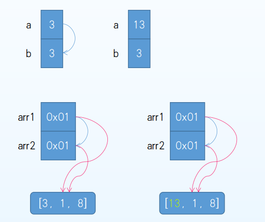
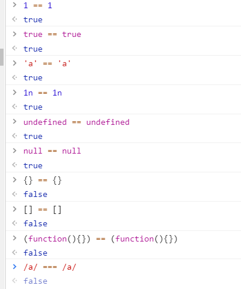

#### js 数据类型

###### 变量

内存中能存储值得空间

###### js 变量八种数据类型  七种原始类型 一种复合类型

- 布尔（Boolean) 
- null
- undefined
- Number (整数或者浮点数) 数字大小是有限制 的 -2^53到2^53
- 任意精度整数(BigInt)，可以存储和操作大整数 100n
- 字符串
- Symbol 创建一个独一无二的值 let key = Symbol()
- 除了上面7种以外的都是对象(Object), 比如 狭义的对象、函数、数组..

###### 使用tpyeof能确定对象的类型

需要注意的是 • 用typeof测试null得到的是"object"，尽管null是一种单独的类型 • 用typeof测试函数得到的是"function"，尽管函数是对象类型 • 可以用Array.isArray(arr) 来判断是不是数组

#### 基础类型

```javascript
//分析输出什么
let a = 3
let b = a
a = 13
console.log(b)  // b还是等于3
let arr1 = [3, 1, 8]
let arr2 = arr1
arr1[0] = 13
console.log(arr2) //arr2 等于 arr1改变后的结果
```

分析，看图



声明a=3,b=a, 则 a b 各在栈内存中占据两个位置，a=3,把a的值给b 相当于把a的值拷贝了一份给b，所以后面更改a的值，跟b没有半毛钱关系

再看下面这个数组就不一样了，数组为引用类型对象，栈中放不下所以就放到了堆内存中，而栈中存放的只是这个堆的地址,当把 arr1 赋值给arr2时，只是把中间存储的地址给拷贝了一份给 arr2而已，实际指向的还是同一片堆内存。（今天我写测试的时候又碰到了，发现理解不够深刻，特意回来补笔记），对于引用类型，它赋值的总是一个引用地址，如果想要实现一个对象的复制，需要创建一个新对象，把旧对象中的每一个属性复制给新对象才可以，后面会写数组的深浅拷贝；

###### 案例

```javascript
let obj1 = {a: 1, b: 2}
let obj2 = {a: 1, b: 2}
console.log(obj1 === obj2)  //输出 fasle 
function sum(a, b) { return a+b }
let sum2 = sum
sum2(3, 4) //正常调用
//分析
// obj1 obj2 各在堆内存中占据一个空间，在栈内存中存储堆的地址，两个地址肯定是不一样的
//函数 sum2 = sum, 因为函数也是引用类型，所以它存储的也是一串地址而已，赋值也就是把地址给了sum2，所以此时两个函数指向同一个堆中的地址，是同一个函数的引用
//函数名就是一个指针，就是一个地址，就是一段代码的引用，说得就是他存储的是一个指向具体函数的地址

```

#### 参数传递

```javascript
function inc(n){ 
    //let n = a  
    n++ 
}
let a = 10 
inc(a)
console.log(a)
// 输出 a = 10; 因为 a 是基础类型，所以当把a 传递给函数 inc时候，相当于在函数内部声明了一个 let  n = a;也就是把 a的值赋值给 n，那 n++ 和 a 有没有关系，a 自然还是 10喽！
function incObj(obj){ 
    //let obj = o //0x0001
    obj.n++ 
}
var o = {n: 10} //o = 0x0001
incObj(o) 
console.log(o)
//同上，但因为 o 是引用类型，所以是把 o 的地址赋值给了 参数 obj，此时他俩指向的是同一个堆内存，也就是同一个对象，一个改变另一个自然也会改变，所以输出 11；

```

##### 总结

###### 应该用三个等号比较的，   基础类型比较的是值，引用类型比较的地址



#### 深浅拷贝

###### 浅拷贝 当数组中仅有基础类型，可以实现完全拷贝，但如果有引用类型，比如对象，此时就是浅拷贝

```javascript
//拷贝对象是数组的情况
function shallowCopy(arr){
  let resArr = [];
//   arr.forEach(item=>{
//     resArr.push(item)
//   })
   for(let i in arr){
       resArr[i] = arr[i]
   }
  return resArr;
}
//或者更简单
const shallowCopy = arr => arr.map(item=>item);

//浅拷贝 包含对象的方法
let arr = [3,4,5,6,[6,7]];
function shallowCopy(src){
    //判断参数是对象还是数组,
    let result = Array.isArray(arr)?[]:{};
    for(let key in src){
        result[key] = src[key]; //数组和对象都可以用【】来取值，赋值
    }
    return result;
}
console.log(shallowCopy(arr)); //当arr[6.7]改变时，新数组也会改变，浅拷贝
```

#### 深拷贝

```javascript
//层层拷贝，考虑用递归
function deepCopy(src){
	let result = Array.isArray(src)?[]:{};
    for(let key in src){
        //判断遍历的值是基础类型还是引用类型,如果是引用类型并且不是null，因为null属于基础类型
        if(typeOf src[key] ==='object' && src[key]!==null ){
            result[key]=deepCopy(src[key]);
        }else{
            result[key] = src[key];
        }
    }
}
```

