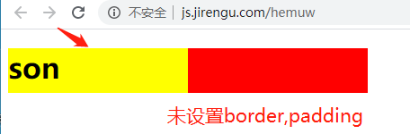
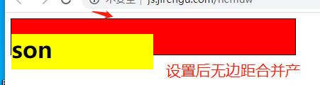

#### 盒模型

######  标准盒模型

设置的width 和 height 指的是Content,margin不计入实际大小，但会影响盒子实际占用空间

##### IE盒模型

设置的width和height包含内边距和边框

想让页面所有的盒子都使用 ie 盒模型 分析下面哪种写法更好

```css
*{
    /* 默认是 content-box */
	box-sizing:border-box;   
}

html{
    box-sizing:border-box;
}
*,*::before, *::after {
    box-sizing:inherit;
}
/* 下面这种写法更好，我们给html设置 box-sizing,这个属性是可继承的属性，html是最顶点的标签，下面所有的标签都可以继承它的可继承属性，这样写的好处是，当我们想要改变下面某个层级的样式时，我们直接给这个层级的最高层改变即可，它下面的子元素会继承父类的样式 */
```

#### 样式继承

##### 常见继承属性

**color、 font-size、font-family、line-height**

##### 非继承属性

**border、background、margin、padding、display**

这个链接查看属性是否可继承

https://www.w3.org/TR/CSS21/propidx.html

###### 控制继承

inherit 使用继承自父级的样式

initial  使用该属性的initial value（该默认值不是前面讲过的浏 览器默认值 user agent stylesheet）

上面那个链接可以查看属性的默认值

unset  如果是继承属性则继承父级，如果是非继承属性就用 initial value

margin-left:auto 会实现居右的效果，因为左侧是auto的；

#### 宽度 100%

```css
/* width: 100%代表什么意思？*/
/* height: 100% 怎么用？*/
这是一个相对的概念，相对于父容器内容的高度或者宽度 注意是内容不加内边距和边框，设置自己 内容 的宽度或者高度与父容器的 内容 的宽度和高度一样，撑满父容器；注意仅仅是内容，不包括边框和padding,如果有padding和border 会超出父容器；父容器一定要设置了宽度和高度，子容器才可以这样写。
```


#### 外边距概念 border、background、margin、padding、display

**外边距合并指的是，当两个垂直外边距相遇时，它们将形成一个外边距。**

**合并后的外边距的高度等于两个发生合并的外边距的高度中的较大者。**

块级元素的上外边距和下外边距有时 会合并（或折叠）为一个外边距，其 大小取其中的最大者 • 浮动元素和绝对定位元素的外边距不 会折叠


相邻元素  相邻的两个块级元素之间的外边距会折叠

父子元素  如果在父元素与其第一个子元素之间不存在边框、内边距、 行内内容，也没有创建块格式化上下文、或者清除浮动将两者的 margin-top 分开，父子外边距会折叠

空的块级元素  如果一个块级元素中不包含任何内容，并且在其 margin-top 与 margin-bottom 之间没有边框、内边距、行内内容、 height、min-height 将两者分开，则该元素的上下外边距会 折叠

**只有块级元素，上下边距会合并，左右并不会**

##### 如果参与折叠的外边距中包含负值，折叠后的外边距的值为最大的正边距与最 小的负边距（即绝对值最大的负边距）的和。 如果所有参与折叠的外边距都为负，折叠后的外边距的值为最小的负边距的值。 这一规则适用于相邻元素和嵌套元素。

###### 有哪些方法可以阻止合并？

1. 加border 

2. 加padding 
3. 创建块级格式化上下文
4.  改变盒子特性（如浮动、绝对定位、改变display）

```html
  <div class="box">
   <h1 class="son">son</h1>
  </div>

.box{
  width:400px;
  background:red;
  height:50px;
}
.son{
  background:yellow;
  height:100%;
  width:200px;
}
效果如下图
```



