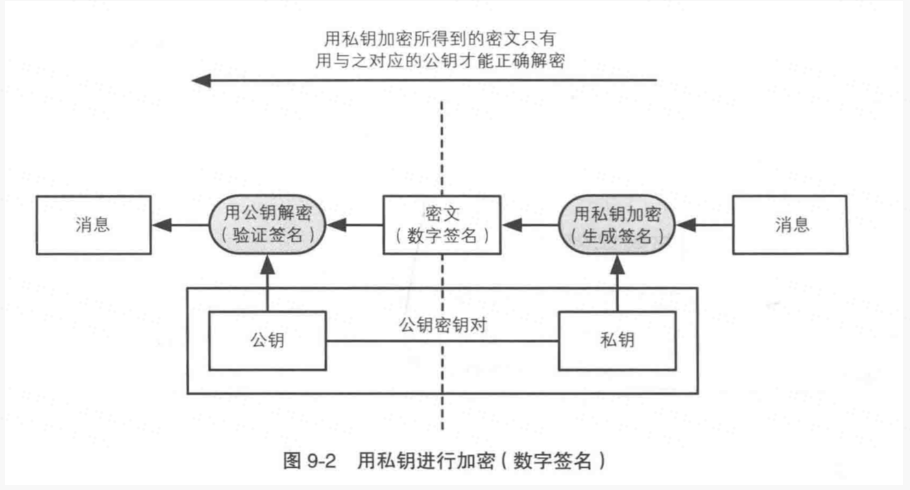

#### 密码学工具箱

###### 信息安全所面临的威胁

#### 概念

**对称加密**

###### 一个密钥加密解密，速度快  

- DES
- AES

**非对称加密**

###### 两个密钥。公钥加密，私钥可解密。速度慢 

- RSA

##### 举例说明非对称加密的场景

两个主人公 Alice Bob ，消息的发送者Alice，消息的接收者Bob

1.Bob 生成密钥对（Bob的公钥，Bob的私钥）

2.Bob将公钥发送给Alice （怎么发的先不管）

3.Alice用Bob的公钥对消息进行加密，将消息变成密文

4.Alice 将密文消息发送给Bob

5.Bob 用自己的私钥对密文进行解密

问题来了，这样加密消息虽然安全，但非对称加密速度太慢，如果加密一大段消息就更慢了，往下看：

**用对称提高速度，用公钥保护会话密钥 ------- 混合密码系统**

1.发送方用对称密码加密消息（速度快）

2.再使用接收方的公钥加密会话密钥(上面的加密信息)（非对称加密）此时不加密大段的消息，而是加密一个随机的字符串

3.接收方接收到后，使用自己的私钥解密对方使用公钥加密的会话密钥，再使用会话密钥解密对称加密的消息即可（此时速度快，又保证了安全性）

**以上解决了数据的机密性问题，即不会被窃取，泄露，比如果被人看到。。。**

#### 单向散列 （hash 哈希）

<!--more-->

###### 把一堆数据压缩成固定长度，不能恢复。用于检测数据的完整性。

- MD5
- SHA1,SHA256

无论多大的数据经过散列处理之后，总会变成一个32字节的散列值

我们经常在下载文件时看到链接后面有一串md5值，用处就是说，我们把文件下载下来之后，用MD5工具处理一下这个文件，然后看跟它给的这个值是否一致，如果一致说明是安全的，如果不一致，可能中途被人拦截，做了处理，数据就不完整，不准确；

当然，最完美的比对方法就是拿两个原始的数据进行比对，但是存在一个问题，这两个原始数据小还好，一会儿就能比对完成，如果数据巨大，几个G，是不是花费的时间就会很久，把它散列处理之后，比较起来就省时多了。

#### 消息认证码  （验证是否真实）

**散列+共享密钥**

散列值加共享密钥（接收双方均有）处理的结果的组合体

应用：

Alice 向 Bob 发送消息，Alice 使用共享密钥处理消息认证码，得出一个计算后的mac值，发送给Bob,Bob也通过共享密钥计算出一个MAC值，把这两个mac值对比，如果一致，认证成功。

**解决了验证用户的问题，确定这个消息是真正的对方发来的，因为双方的密钥只有双方知道**

#### 数字签名

应用：

就是发送方用自己的私钥加密消息生成数字签名发送给对方，同时把消息的明文也发过去，对方收到后使用发送方的公钥进行解密，如果解密后的消息与对方发送的明文消息一致，说明则签名验证成功，数据是真正的对方发的，因为私钥只有自己才有，别人不可能拿到；

但问题来了，这个其实也是非对称加密呀，所以消息多的时候，速度自然会变慢

**速度更快的签名   签名就是先散列运算再用自己的私钥加密信息的一个值**

1. 发送者 Alice 用单向散列函数计算消息的散列值

2. Alice 用自己的私钥加密这个散列值 得到一个签名（值小，所以就算是非对称加密，速度也会相对快很多）
3. Alice 将消息和签名发送给Bob
4. Bob 收到后，将消息通过散列得到一个散列值，然后用Alice的公钥解密发来的签名，通过解密Bob收到的就是Alice 经过散列处理的消息的散列值，
5. Bob 将解密得到的散列值与Alice直接发送的消息的散列值（bob 自己计算得到）对比，如果两者一致则签名验证成功。

#### 证书

以上所有模型都假设接收方有发送方的公钥，那么这个公钥接收方是怎么得到的呢？这时候，就引出了CA的概念，一个机构，用来发布证书（用自己的私钥公正加密对方的信息，所有人都来CA注册，CA保留对方的公钥，需要的时候，找CA要即可）

下次如果接收方收到对方的消息，而它不确定这个消息是对方发的（万一被伪造了），这个时候，它可以使用ca那边对方的公钥来解密对方发来的签名，然后对比对方发来的消息的散列值，如果一致，证明是对方，也就是上面的流程！