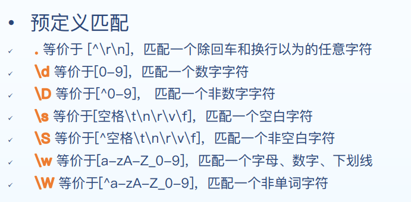
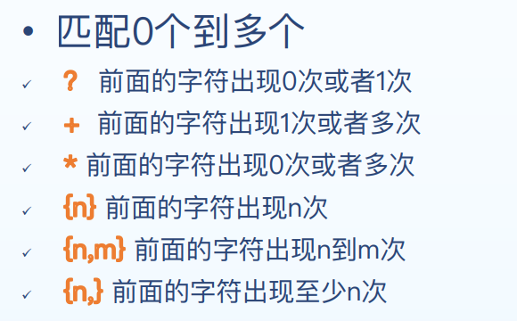
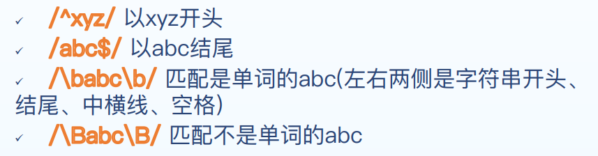
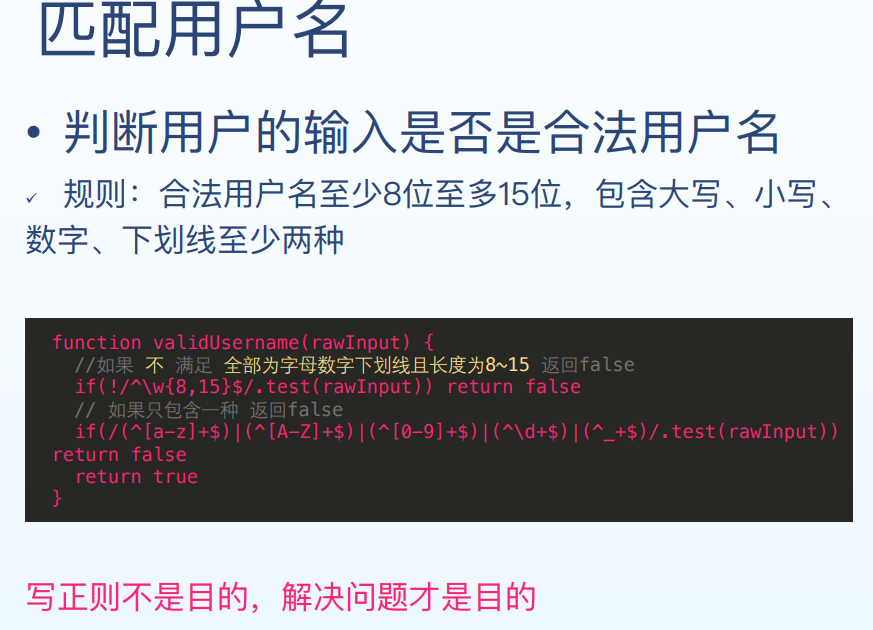
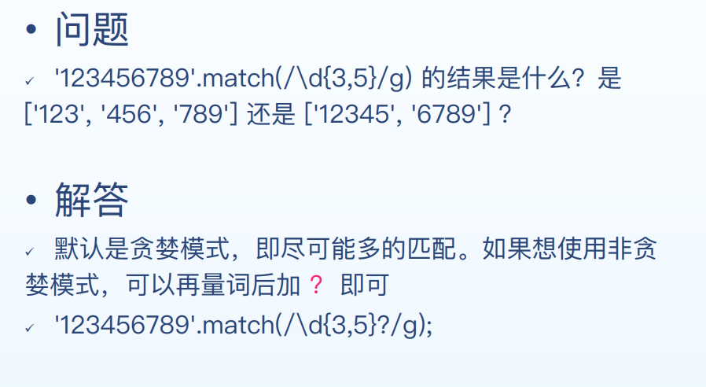

#### 创建方式

- 字面量方式创建  let reg = /+86\d{11}/g
- 构造函数方式创建  let reg = new RegExp('+86\d{11}', 'g')
- g：global，全文搜索，不添加的话搜索到第一个结果停止搜索 
-  i：ingore case，忽略大小写，默认大小写敏感 
-  m：multiple lines，多行搜索
- 如果要匹配这些特殊字符，需要转义\

#### 字符串方法

```javascript
let str = 'hello1 jirengu, hello2 world'
str.search(/hello\d/) //0
str.match(/hello\d/g) //['hello1', 'hello2']
str.replace(/hello\d/g, 'hi') // 'hi jirengu, hi world'
str.split(/\s/) //["hello", "jirengu,", "hello", "world"]
```

#### 字符匹配

范围匹配:

- [abcd] 匹配一个字符，是a b c d中的任意一个 
-  [0-9] 匹配一个是0到9的数字 ü [a-zA-Z]匹配一个不限制大小写的字母 
-  [^abc\] 表示一个不是字符a或b或c的字符

#### 预定义匹配

- **\.**等价于 [^\r\n\]，匹配一个除回车和换行以为的任意字符 

- \\d等价于[0-9]，匹配一个数字字符 

- \\D 等价于[^0-9\] 匹配一个非数字字符 

-  \\s等价于[空格\t\n\r\v\f]，匹配一个空白字符 

- \\S 等价于[^空格\t\n\r\v\f\]，匹配一个非空白字符 

- \\w等价于[a-zA-Z_0-9]，匹配一个字母、数字、下划线 

- \\W 等价于[^a-zA-Z_0-9\]，匹配一个非单词字符

  			

#### 量词  匹配0个到多个



#### 边界  以...开头或者以...结尾



<!--more-->

#### 案例

匹配用户输入



#### 贪婪模式与非贪婪模式



#### 分组  把一些字符作为一个整体

```javascript
//匹配 hungerrr ，而不是 hungerhungerhunger
/hunger{3}/
//把hunger作为一个整体，匹配 hungerhungerhunger
/(hunger){3}/
//匹配 “hello world” 和 “hi world”
/(hello)|(hi) wolrd/
//$1代表正则里分组匹配的内容，输出 “hi8 world, hi6 jirengu”
"hello8 world, hello6 jirengu".replace(/hello(\d)/g, 'hi$1')
```

更详细的用法参考MDN