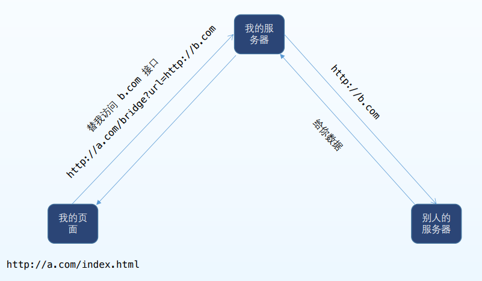

#### 跨域同源策略

###### 浏览器出于安全方面的考虑，只允许同源下的接口交互

**同源**

- 同协议
- 同域名
- 同端口

一般跨域是b/s系统才有，c/s没有跨域问题

**跨域问题**

跨站 HTTP 请求(Cross-site HTTP request)是指发起请求的资源所在域不同于该请求所指向资源所在的域的 HTTP 请求。

`跨域问题`只有在浏览器才会出现，javascript等脚本的主动http请求才会出现`跨域问题`。后端获取http数据不会存在跨域问题。`跨域问题`可以说是浏览器独有的（或者说http客户端独有的，这个其实看制定者是否遵循协议）。

跨站 HTTP正常请求，就是说请求还是会正常发送到服务器，服务器也给了响应，因为如果是http,服务器，是无状态的，来请求就会有相应；只是浏览器拦截了而已；**浏览器还是会发出这个请求，但是它会拦截响应内容，如果发现响应header中"Access-Control-Allow-Origin"设置的允许访问的源没有包含当前源，则拒绝将数据返回给当前源。**

为了证明浏览器确实发出请求了，并且接收到数据了，可以用fidller抓包来分析一下，会发现相应报文里面有数据，只是浏览器拒绝返回给我们而已；

**浏览器同源策略的作用是防止跨站请求伪造。**

#### 如果想跨域请求第三方接口，或者 把自己的接口提供给第三方，要如 何做呢？

**JSONP**

原理：

###### 同源策略只限制Ajax请求，不限制 script 标签加载js.可以通过 script 标签请求资源，并提前写好接收函数

```javascript
<script>
function handleData(data) {
console.log(data)
}
</script>
<script src=“http://api.jirengu.com/getWeather.php?callback=handleData”>
```

###### 服务器收到请求后，从 callback 参数中得到 fn(handleData),然后把请求的结果包装，变成fn(res)的形式返回

##### script 里面的资源加载后会当成 js 执行，就会执行 handleData(res),我们就拿到了请求的数据

#### 使用promise封装一个 JSONP (基于后端支持的情况，即后端将数据封装在函数中)

<!--more-->

```javascript
function jsonp(url,data={}){
     return new Promise((resolve,reject)=>{
        //给window绑定一个全局函数，函数接受一个服务器端返回的结果参数
        //服务器返回这个函数后，浏览器执行这个函数的时候将结果，resolve 出来，在then 里面可以接收
        window._fn_ = data=>resolve(data)
        //创建 script 标签
        let script = document.createElement('script')
        // 处理请求的参数
        let query = Object.entries(data).map(a=> `${a[0]}=${a[1]}`).join('&')
        // 给script 的src 赋值
        script.src = url+'?callback=_fn_&'+query
        script.onerror =()=> reject('加载失败')
        //这个标签仅用来加载数据，加载完后删除即可
        document.head.appendChild(script);
        document.head.removeChild(script);
    })
}

//调用
jsonp('http://api.jirengu.com/getWeather.php', {city: '北京'})
    .then(data=>{
		console.log(data)
	}).catch(
    		e=>console.log(e)
			)
```

#### CORS

原理

###### 发送 ajax 请求时，浏览器发现该请求不符合同源策略，会给该请求加一个请求头 ： origin.后台收到请求后，如果确定接受请求则在返回结果中加入一个响应头：Access-Control-Allow-Origin;浏览器收到返回时，判断该响应头中是否包含当前 origin的值，如果有则浏览器会处理响应，我们就可以拿到响应数据，如果没有，浏览器直接驳回；

此时，前端什么都不用做，服务端加个 Access-Control-Allow-Origin 响应头

```javascript
const http = require('http')
const url = require('url')
http.createServer((req, res) => {
let urlObj = url.parse(req.url, true)
if(urlObj.pathname === '/getWeather') {
    //关键点
res.setHeader('Access-Control-Allow-Origin', 'http://js.jirengu.com')
//res.setHeader('Access-Control-Allow-Origin', '*')
res.end(JSON.stringify( { city: 'hangzhou', weather: 'sunny' } ))
} else {
res.writeHead(404, 'Not Found')
res.end('not found')
}
}).listen(8888)

//调用
//当前代码在 http://js.jirengu.com 下运行
fetch('http://127.0.0.1:8888/getWeather')
.then(res => res.json())
.then(data => console.log(data))
//只需要这行代码即可
res.setHeader('Access-Control-Allow- Origin','*')
```

#### JSONP和CORS都需要服务器 配合，如果不配合怎么办

**服务器中转**



###### 服务器之间是不存在跨域的，所以我们可以模拟一个自己的服务器，然后请求自己的服务器，带上我们要请求数据的url作为参数，我们的服务器拿到这个参数，取请求最终的服务器，返回结果后再给我们使用即可

例如：

```javascript
//中转服务器
const http = require('http')
const url = require('url')
http.createServer((req,res)=>{
    let urlObj = url.parse(req.url,true)
    if(urlObj.pathname === '/bridge'){
        //http 包的方法
        http.get(urlObj.query.url,req=>{
            let text =''
            //回头把node 这些内容看下，一脸懵逼现在
            req.on('data',data=>text+=data)
            req.on('end',()=>{
                res.setHeader('Access-Controll-Allow-Origin','*')
                res.end(text)
            })
        })
    }else{
        res.writeHead(404,'not found')
        res.end('not found')
    }
}).listen(8888)

//调用
//当前代码在 http://js.jirengu.com 下运行
fetch('http://localhost:8888/bridge?url='+encodeURIComponent('http://baidu.com'))
.then(res=>res.text())
.then(data => console.log(data))
```

#### node

```javascript
let req = http.get('http://www.baidu.com',res=>{
    //用来接收结果中的数据
    res.on('data',data=>{
        console.log(data)
    })
})
req.end();
```

